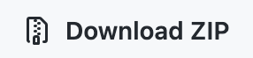

## Informacja o projekcie

Projekt utworzony na potrzeby szkolenia z języka R w dniach
29-30.09.2022

W projekcie znajdują się następujące foldery:

-   `data-raw` -- folder z danymi surowymi
-   `data` -- folder z danymi przetworzonymi
-   `figs` -- folder z wykresami

W folderze znajdują się również notatniki oraz skrypty z kodami R:

-   `1-przyklad-skryptu.R` -- plik R zawierający proste kody oraz
    komentarze. Jest to przykład jak można pracować w R z poziomu pliku
    z rozszerzeniem `.R`.
-   `1-podstawy-quarto.qmd` -- plik qmd zawierający przykładowy dokument
    quarto na potrzeby przygotowywania odtwarzalnych wyników badań.
-   `2-podstawy-R.qmd` -- plik zawiera podstawy R: wczytywanie plików,
    tworzenie wykresów, testy statystyczne, regresję liniową
-   `wejściówka.qmd` - plik zawiera rozwiązanie wejściówki z drugiego
    dnia szkolenia

## Pobranie projektu

Aby pobrać projekt należy kliknąć na zielony przycisk
{width="55"} i wybrać {width="104"}.
